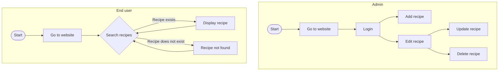
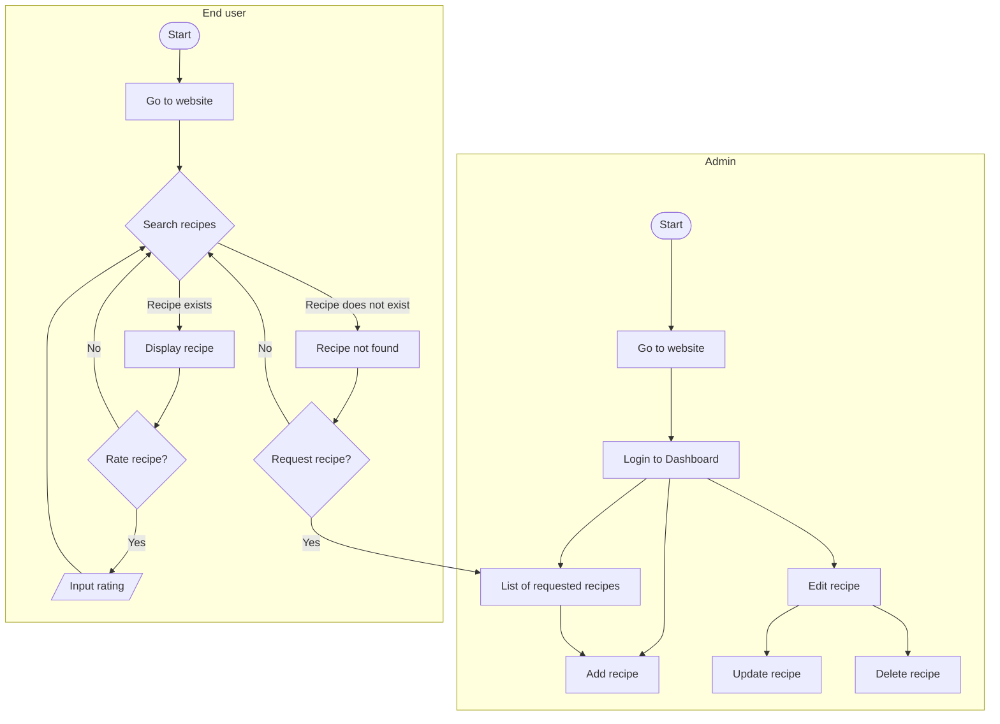

# Recipe Management System

## Usage
### Codespaces
1. `python app.py`

### Local
1. `pip install -r requirements.txt`
2. `mysql < database_query.sql && mysql < database/account.sql && mysql < database/recipes.sql && mysql < database/ingredients.sql && mysql < database/recipe_ingredients.sql`
3. `python app.py`

## Flowchart
### Implemented

### Proposed
